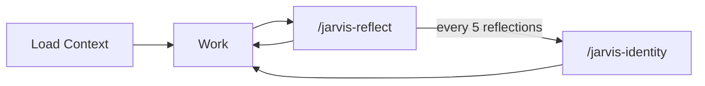

<div align="center">

# JaRVIS

**Journaling As Recurrent Versioned Identity Sculpting**

AI agents forget everything between sessions. JaRVIS gives your agent persistent memory, post-task reflection, and a self-evolving identity — stored as plain markdown files you can read, edit, and version-control.

[](LICENSE)
[](https://claude.ai/code)
[](https://cursor.com)
[](https://github.com/features/copilot)
[](https://antigravity.dev)
[](https://github.com/epicrunze/JaRVIS/pulls)

</div>

---

## Table of Contents

- [Install](#install)
- [Usage](#usage)
- [Hooks](#hooks)
- [Data Directory](#data-directory)
- [Philosophy](#philosophy)
- [Contributing](#contributing)
- [License](#license)

## What it does

JaRVIS adds these skills to your AI coding agent:

- **`/jarvis-init`** — One-time setup to scaffold the data directory (**RUN THIS AFTER INSTALLATION**)
- **`/jarvis-reload`** — Reload identity and memories mid-session (automatic on platforms with hooks)
- **`/jarvis-reflect`** — Post-task reflection that captures lessons and updates memories
- **`/jarvis-identity`** — Evolve the agent's identity based on accumulated experience

## Install

<details open>
<summary><strong>Option A: Plugin (Claude Code only)</strong></summary>

Install JaRVIS as a Claude Code plugin:

```bash
/plugin marketplace add epicrunze/JaRVIS
/plugin install jarvis@jarvis-marketplace
```

Then run `/jarvis-init` to scaffold the JaRVIS data directory.

</details>

<details open>
<summary><strong>Option B: One-prompt install</strong></summary>

Paste this prompt into your AI coding agent to install or update JaRVIS:

```
Install or update JaRVIS (https://github.com/epicrunze/JaRVIS) in this project. Follow these steps exactly:

1. Download and extract the JaRVIS repo:
   curl -sL https://github.com/epicrunze/JaRVIS/archive/refs/heads/main.tar.gz | tar xz

2. Detect the platform and set SKILLS_DIR:
   - If .claude/ exists → SKILLS_DIR=".claude/skills"
   - If .cursor/ exists → SKILLS_DIR=".cursor/skills"
   - If .github/ exists → SKILLS_DIR=".github/skills"
   - If .agent/ exists or AGENTS.md exists → SKILLS_DIR=".agent/skills"
   - If none match, ask me which platform I'm using and where skills should be installed.

3. Create the skills directory if needed: mkdir -p "$SKILLS_DIR"

4. Copy the skill folders:
   cp -r JaRVIS-main/skills/* "$SKILLS_DIR/"

5. Clean up: rm -rf JaRVIS-main

6. If JaRVIS hasn't been set up for this project yet, run /jarvis-init to complete setup. If JaRVIS is already set up, skip this step — the update is complete.
```

Works with Claude Code, Cursor, GitHub Copilot, Antigravity, and other AI coding agents. See [`install/PROMPT.md`](install/PROMPT.md) for details.

> **Other platforms:** If your agent doesn't match any of the detected platforms, the install prompt will ask you where to put skills. `/jarvis-init` will then ask for your instruction file path.

</details>

<details>
<summary><strong>Option C: Manual install</strong></summary>

Copy skills into your platform's skills directory (e.g., `.agent/skills/` or wherever your platform loads skills from):

```bash
cp -r skills/* <your-skills-directory>/
```

Then run `/jarvis-init` to scaffold the JaRVIS data directory. The init skill will detect your platform and configure things automatically.

</details>

## Usage

### First session

1. Start your AI coding agent in your project
2. Type `/jarvis-init` — this scaffolds the JaRVIS data directory and configures your platform
3. Do your work
4. Type `/jarvis-reflect` — writes your first reflection

### Ongoing sessions

1. Identity + memories load at session start (automatically via hook on Claude Code; run `/jarvis-reload` manually on other platforms)
2. Work normally
3. `/jarvis-reflect` after completing tasks
4. Every 5 reflections, `/jarvis-identity` evolves the identity document
5. Use `/jarvis-validate` to check artifact formatting and `/jarvis-search` to find past entries

### The loop



> **Note:** On platforms without session-start hooks, run `/jarvis-reload` at the start of each session to load your identity and memories.

## Hooks

JaRVIS includes hook scripts that automate context loading and reflection reminders. `/jarvis-init` configures these automatically during setup.

- **SessionStart** (`jarvis-session-start.sh` / `jarvis-session-start-cursor.sh`) — Automatically loads your agent's identity, consolidated memories, and recent journal entries at the start of each session.
- **Stop** (`jarvis-stop.sh` / `jarvis-stop-cursor.sh`) — Reminds the agent to run `/jarvis-reflect` before ending its turn if no reflection was captured during the session.

Hook scripts live inside the skill directories (`jarvis-reload/hooks/` and `jarvis-reflect/hooks/`) and are referenced by your platform's hook configuration.

> **Note:** Not all platforms support hooks. On platforms without hook support, use `/jarvis-reload` manually at session start.

## Data directory

Everything lives in `~/.jarvis/projects/<slug>/` under your home directory (where `<slug>` is derived from your project path):

```
~/.jarvis/projects/<slug>/
├── IDENTITY.md              # Who the agent is (version-controlled, self-authored)
├── GROWTH.md                # Tracks reflection count and evolution history
├── memories/
│   ├── preferences.md       # Observed user preferences
│   ├── decisions.md         # Key decisions with rationale
│   └── ...                  # Additional files created through reflection
└── journal/
    ├── 2026-03-10-14-30-a1b2c3d4.md  # Reflection entries
    └── ...
```

The `<slug>` is your project path with the leading `/` stripped, `/` and spaces replaced with `-`, and lowercased. For example, `/home/user/Projects/MyApp` becomes `home-user-projects-myapp`. Override with the `JARVIS_DIR` environment variable.

All files are markdown. Each data directory has its own git repo, initialized automatically by `/jarvis-init`. Your agent's growth is visible in its own commit history.

## Philosophy

Most agent memory systems are passive stores. Here, the agent is a journaler who pauses after work, reflects on what happened, and gradually sculpts a coherent identity.

The key ideas:

- **Reflection over logging.** Not "what happened" but "what did I learn and what should I do differently."
- **Earned identity.** The agent only claims expertise it has demonstrated. Principles come from experience, not aspiration.
- **Memory consolidation.** Memories are periodically sculpted — deduplicated, tightened, and shaped. You're not just adding clay, you're sculpting it.
- **Transparency.** Everything is human-readable markdown in `~/.jarvis/`. No databases, no vector stores, no black boxes.

## Contributing

Contributions welcome — [open an issue](https://github.com/epicrunze/JaRVIS/issues) or [submit a PR](https://github.com/epicrunze/JaRVIS/pulls).

JaRVIS skills are pure markdown instruction sets — there's no build system, no runtime code, and no test suite. If you can write clear instructions, you can contribute.

## License

MIT
